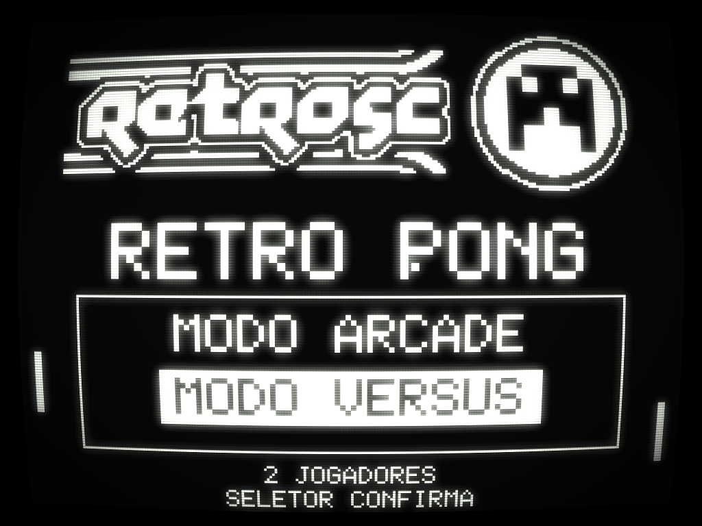
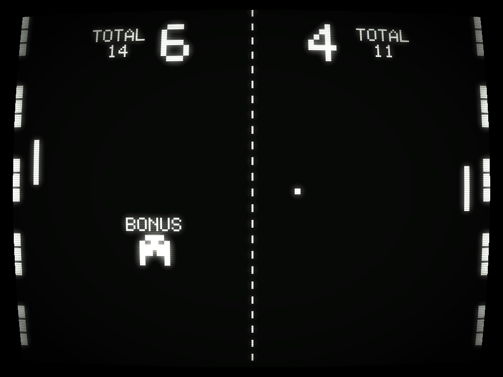
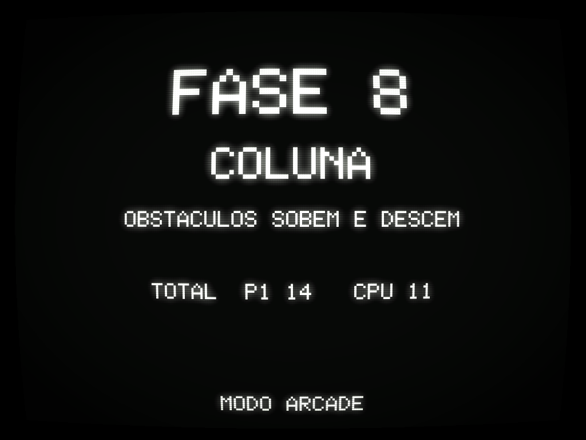
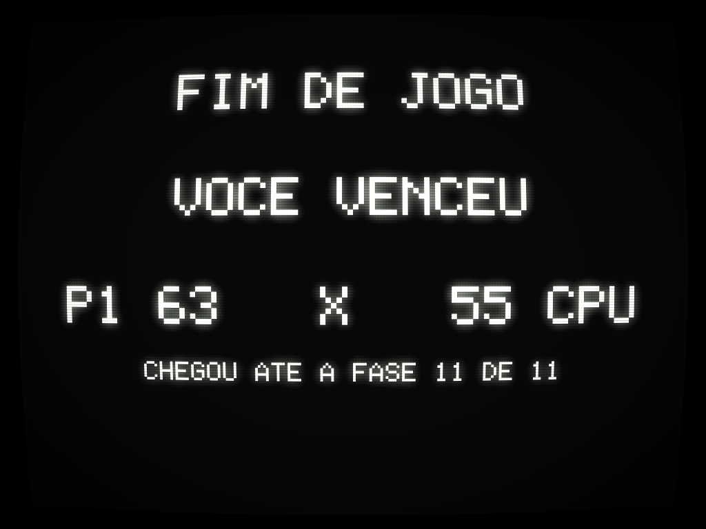
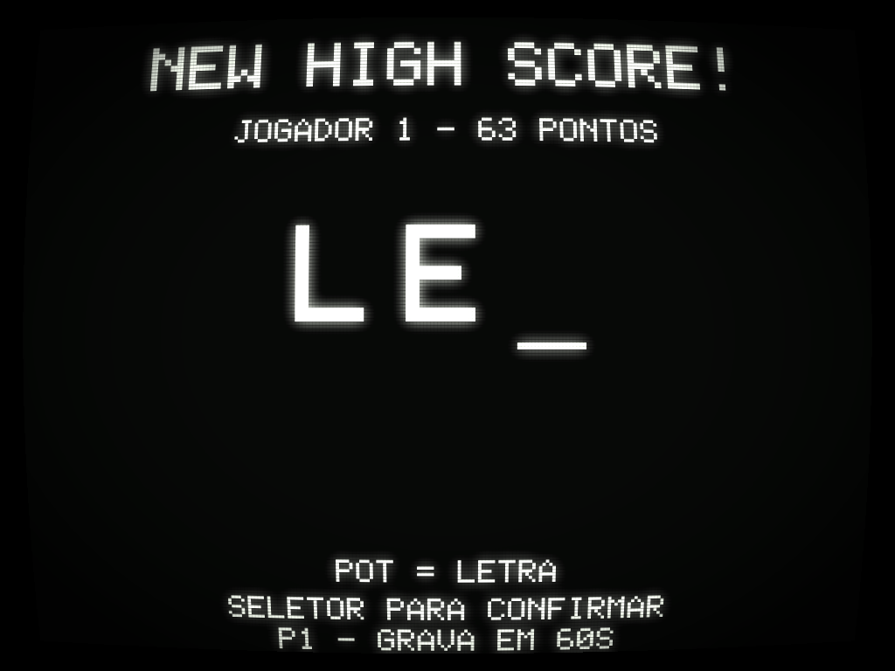
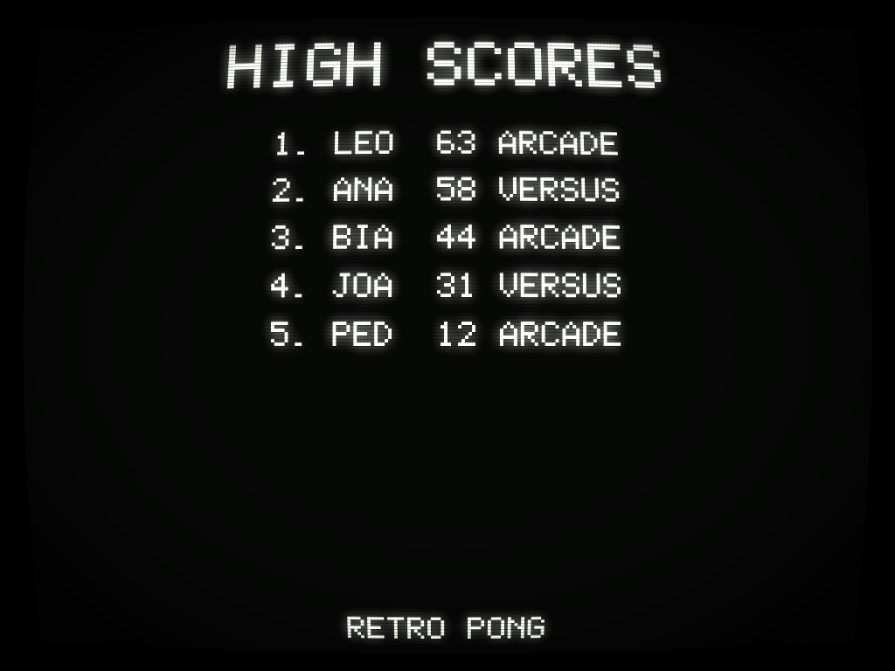

# RetroSC Pong — Raspberry Pi Pico (RP2040)

Pong para 1 ou 2 jogadores em um Raspberry Pi Pico, com saída de **vídeo
composto** (NTSC 1-bit gerado por PIO) e **áudio PWM**. Foi feito para uma
máquina arcade do evento [**RetroSC**](https://retrosc.org/).


## Recursos

- Vídeo composto NTSC 256×192, 1-bit, ~60 Hz, gerado inteiramente em PIO + DMA
  (CPU livre para o jogo).
- 2 raquetes controladas por **potenciômetros 10 kΩ** (ADC do Pico).
- **Dois modos**, escolhidos no menu do attract: **arcade** (1 jogador contra a
  CPU) e **versus** (2 jogadores). Os dois jogam as mesmas fases.
- **10 fases** em sequência, em ordem crescente de dificuldade, cada uma até
  9 pontos, e cada ponto soma no **total geral**:
  1. **PONG CLASSICO** — o pong de sempre;
  2. **TRIPLO** — a raquete vira 3 pedaços de 8 px com vãos entre eles;
  3. **NAVE** — uma nave sobe e desce no meio da quadra atirando: **a bola
     rebate nela** e o tiro que pega uma raquete deixa ela pela metade por 5 s.
     Quem acerta a nave leva o troco: ela revida na hora, com um tiro pelo lado
     de quem rebateu a bola;
  4. **BARREIRA I** — 2 muros de tijolos quebráveis no meio da tela;
  5. **PINBALL** — sete obstáculos fixos no meio da quadra: um losango com um
     poste solto acima e outro abaixo;
  6. **BARREIRA II** — 3 muros, agora espaçados entre si;
  7. **COLUNA** — cinco dos mesmos obstáculos, empilhados no meio e subindo e
     descendo juntos;
  8. **MURALHA** — uma parede de tijolos atrás de cada raquete: só marca ponto
     quem enfia a bola num dos vãos (a parede se refaz a cada ponto);
  9. **REBOUND** — vôlei: as raquetes deitam no chão e andam na horizontal
     dentro da própria meia-quadra, a bola tem gravidade e o ponto sai quando
     ela toca o chão do lado adversário;
  10. **BARREIRA III** — 4 muros (2 por jogador), já divididos em blocos de
      5-4-2-4-5 fileiras com um corredor vazio entre eles: a mais dura, por
      isso fecha o jogo.

  Nas três barreiras o estrago fica até o fim da fase: quando abre um vão de
  ponta a ponta, aquela fase volta a ser um pong normal.
- **Mascote-bônus**: em quatro fases — **1 (clássico), 2 (triplo), 4 (barreira I)
  e 8 (muralha)**, as que têm o meio da quadra livre — o
  mascote da RetroSC cruza a tela na diagonal — às vezes de cima para baixo,
  às vezes de baixo para cima — com a palavra **BONUS** piscando ao lado. Ele
  passa **no máximo duas vezes por fase**, e acertá-lo com a bola dá um prêmio
  **sorteado na hora** para quem rebateu por último — o nome dele aparece por
  2 s do lado de quem levou. A CPU joga com as mesmas armas:

  | prêmio | o que faz |
  | --- | --- |
  | **BONUS +3** | 3 pontos **só no total geral** — o placar da fase não muda, e o total pisca um instante |
  | **RAQUETE MAIOR** | a sua raquete cresce 50% por 10 s |
  | **ENCOLHEU O RIVAL** | a raquete do adversário fica pela metade por 10 s |
  | **ESCUDO** | um muro de tijolos quebráveis aparece na frente do seu gol por 10 s; ele tem vãos por onde a bola ainda passa, some tijolo a tijolo e pisca no último segundo |
  | **TURBO** | por 10 s, cada bola que **você** rebate sai acelerada; ela volta ao normal sozinha depois de 1,5 s e só acelera de novo no seu próximo toque |

  Os quatro efeitos temporizados contam 10 s de **jogo** e atravessam o ponto:
  quem ganha no fim de um rali leva o resto do tempo para o seguinte.
- **Pausa**: apertar o SELETOR durante a partida abre *CONTINUAR* / *SAIR DO
  JOGO*. A escolha anda pelo **movimento** do pot (não pela posição dele), então
  o menu sempre abre em *CONTINUAR*; o SELETOR confirma e sair volta ao attract.
  Passados **30 s**, a opção destacada vale sozinha — a tela não fica parada
  para sempre numa máquina de evento.
  Ao voltar ao jogo, a raquete de quem mexeu no pot durante a pausa fica
  **piscando e parada** até o pot voltar ao lugar em que estava — pausar não
  serve para reposicionar a raquete e salvar uma bola perdida.
- **Attract screen** com logo da RetroSC + demo automático (AI vs AI),
  revezando com a tabela de recordes a cada 20 s, e um **menu de modo** que só
  aparece depois de apertar o botão **SELETOR**.
- **High scores persistentes** na flash do RP2040 com **iniciais de 3 letras**
  estilo arcade — o pot escolhe cada letra e o botão SELETOR confirma. O que
  entra no ranking é o **total acumulado** (no arcade, sempre o do humano —
  ou seja, quanto ele fez até a fase em que parou).
- Áudio com os sons clássicos do Pong (raquete, parede, ponto) mais tijolo
  quebrado e beeps do menu, em PWM filtrado.
- Botão **SELETOR**: abre o menu, escolhe o modo e confirma as iniciais.

## Estrutura do repositório

```
pong-rp2040/
├── CMakeLists.txt
├── pico_sdk_import.cmake
├── README.md
├── LICENSE
├── docs/
│   ├── schematic.md     <-- esquemático por blocos (diagramas SVG)
│   ├── pinout.md        <-- pinagem dos 3 módulos RP2040 suportados
│   ├── bom.md           <-- lista de materiais (por referência: R1, C2, J4…)
│   ├── pecas-do-gabinete.md  <-- pots, knobs e itens da caixa: qual comprar
│   └── images/          <-- diagramas, renders da placa, capturas
├── kicad/               <-- PCB: 2 variantes, gerbers prontos p/ fábrica
│   ├── README.md        <-- pipeline (esquemático -> placa -> gerbers)
│   ├── retrosc-pong*.kicad_{sch,pcb,pro}
│   ├── retrosc-pong.pretty/   <-- footprints próprios (RCA, PAM8403)
│   └── gerbers*/ + *-gerbers.zip
├── src/
│   ├── main.c
│   ├── config.h         <-- constantes do projeto (pinos, dimensões, etc.)
│   ├── ntsc.{c,h,pio}   <-- driver de vídeo composto
│   ├── gfx.{c,h}        <-- desenho no framebuffer
│   ├── font.{c,h}       <-- fonte 5x7
│   ├── input.{c,h}      <-- ADC dos pots + botão
│   ├── audio.{c,h}      <-- PWM de áudio
│   ├── highscores.{c,h} <-- persistência na flash
│   ├── game.{c,h}       <-- máquina de estados, modos e física
│   ├── phases.{c,h}     <-- as 4 fases (raquetes especiais, tijolos)
│   └── assets.{c,h}     <-- bitmaps embutidos
└── tools/
    ├── png_to_c.py      <-- conversor PNG → C array
    ├── sim.py           <-- simulador do jogo (pygame)
    ├── crt_preview.py   <-- efeito de tubo nas capturas
    ├── gen_kicad_sch.py <-- gera o esquemático  (--yd p/ a variante)
    ├── gen_kicad_fp.py  <-- gera os footprints próprios
    ├── gen_kicad_pcb.py <-- gera a placa (placement, zonas, silk, logo)
    ├── make_decoy.py    <-- placa-isca p/ o Freerouting + DSN
    ├── import_ses.py    <-- traz o roteamento de volta
    └── dsn_tweak.py     <-- ajusta larguras/isolamento no DSN
```

## Hardware

Veja os arquivos em [docs/](docs/) para detalhes:

- [docs/schematic.md](docs/schematic.md) — esquemático completo
- [docs/pinout.md](docs/pinout.md) — pinagem dos **3 módulos RP2040
  suportados** (Pico oficial, YD-RP2040 de 3 botões e "roxa" de 1 botão) e
  qual variante de PCB usar com cada um
- [docs/bom.md](docs/bom.md) — lista de materiais e custo
- [docs/pecas-do-gabinete.md](docs/pecas-do-gabinete.md) — potenciômetros,
  manoplas e peças da caixa: **qual modelo comprar** e por quê
- [kicad/README.md](kicad/README.md) — as **duas variantes de PCB** prontas
  para fabricar (gerbers zipados)

Resumo do hardware:

| Bloco | GPIO | Componentes (referências do BOM) |
| ----- | ---- | -------------------------------- |
| Vídeo composto | GP16 (sync), GP17 (video) | R1 470 Ω + R2 270 Ω → jack J1 |
| Áudio | GP18 (PWM) | filtro R3 + C1, acoplamento C2, divisor R4/R5, entradas R6/R7 → amp U2 → jacks J8/J9 |
| Botão SELETOR | GP22 | SW1 (para GND) via header J7 |
| Potenciômetro P1 | GP26 (ADC0) | RV1 10 kΩ linear + C3 → header J5 |
| Potenciômetro P2 | GP27 (ADC1) | RV2 10 kΩ linear + C4 → header J6 |

Os GPIOs acima são os mesmos nos três módulos suportados; o que muda entre
eles é **em qual furo** cada GPIO aparece (ver [pinout.md](docs/pinout.md)).

## Como compilar

### 1. Instalar o Pico SDK

**Recomendado (Windows):** baixe o [Raspberry Pi Pico Windows Installer](https://github.com/raspberrypi/pico-setup-windows/releases),
que instala toolchain (ARM GCC), CMake, Ninja, Python e o Pico SDK de uma
vez.

**Manual (qualquer SO):**

```bash
git clone --depth 1 https://github.com/raspberrypi/pico-sdk.git
cd pico-sdk
git submodule update --init
export PICO_SDK_PATH=$(pwd)
```

Instale também:

- ARM GCC (`gcc-arm-none-eabi`)
- CMake ≥ 3.13
- Ninja ou Make

### 2. Build

```bash
git clone https://github.com/lrrosa/retrosc-pong.git
cd retrosc-pong
mkdir build && cd build
cmake -G "Ninja" ..   # ou simplesmente: cmake ..
ninja                 # ou: make -j
```

Resultado: `build/pong-rp2040.uf2`.

### 3. Gravar no Pico

1. Segure o botão **BOOTSEL** do Pico enquanto conecta o USB.
2. O Pico aparece como pendrive (`RPI-RP2`).
3. Arraste `pong-rp2040.uf2` para dentro do pendrive.
4. O Pico reinicia automaticamente rodando o jogo.

## Simulador (Python, sem hardware)

Para iterar em layouts e gameplay sem flashear o Pico, há um simulador que
roda a mesma lógica em Python e carrega os MESMOS bitmaps/fonte do código C:

```bash
pip install pygame
python tools/sim.py
```

Janela 768×576 (framebuffer 256×192 × 3). Controles:

- **Mouse Y na metade esquerda** → pot P1
- **Mouse Y na metade direita** → pot P2
- **Espaço** → botão SELETOR
- **N** → pula para a próxima fase (atalho de debug)
- `--fase N` na linha de comando → começa direto na fase N (0 a 9)
- **R** → zera high scores (só em RAM, não toca a flash do Pico)
- **Q** ou **ESC** → sair

Para regerar as capturas de tela usadas aqui (roda sem abrir janela):

```bash
python tools/sim.py --shots docs/images
python tools/crt_preview.py --all
```

Pré-visualizações com efeito CRT (como deve ficar numa TV de tubo —
scanlines, glow de fósforo, vignette e curvatura):

| Attract | Menu (só após o SELETOR) | Pausa |
| :---: | :---: | :---: |
|  |  |  |

As dez fases:

| 1 · pong clássico (com o mascote-bônus) | 2 · triplo | 3 · nave |
| :---: | :---: | :---: |
|  |  |  |

| 4 · barreira I | 5 · pinball | 6 · barreira II |
| :---: | :---: | :---: |
|  |  |  |

| 7 · coluna | 8 · muralha | 9 · rebound (vôlei) |
| :---: | :---: | :---: |
|  |  |  |

| 10 · barreira III | Fim de fase | Início de fase |
| :---: | :---: | :---: |
|  |  |  |

| Game Over | Enter Initials | High Scores |
| :---: | :---: | :---: |
|  |  |  |

Renderizações "raw" (sem CRT, só o framebuffer escalado) ficam em
`docs/images/sim_*.png`.

> **Limitação:** o simulador não reproduz a fidelidade do sinal NTSC nem
> o timing exato do PIO/DMA. Use para validar UX e visual; o teste final
> do vídeo só com a TV real.

### CRT preview

Para aplicar o efeito CRT (scanlines + bloom + fósforo + vignette +
curvatura) em qualquer PNG do framebuffer:

```bash
pip install pillow numpy
python tools/crt_preview.py docs/images/sim_attract.png        # gera crt_sim_attract.png
python tools/crt_preview.py --all                              # regenera todos os crt_*.png
```

Os parâmetros (intensidade do bloom, dos scanlines, cor do fósforo) estão
no topo de `crt_effect()` em [tools/crt_preview.py](tools/crt_preview.py)
e são bons pontos de partida; mexa neles pra ajustar pra TV verde, âmbar,
ou ajustar o "estado" do tubo.

## Simulador Wokwi (TV de verdade no navegador)

Diferente do simulador Python (que reproduz a lógica do jogo), o **Wokwi roda
o firmware compilado de verdade** no RP2040 emulado e mostra a saída de vídeo
composto numa **TV virtual** (`wokwi-tv`), com potenciômetros, botão e buzzer.

O `wokwi-tv` não usa DAC resistivo: ele lê os 2 pinos digitais direto e segue
os pulsos de sync (funciona com NTSC e PAL). Os arquivos já estão no repo:

- [`diagram.json`](diagram.json) — fiação: `GP16→SYNC`, `GP17→IN`, 2
  potenciômetros em `GP26`/`GP27`, botão SELETOR em `GP22`, buzzer em `GP18`.
- [`wokwi.toml`](wokwi.toml) — aponta para `build/pong-rp2040.uf2`/`.elf`.

Como rodar (extensão do VS Code, mais confiável que o site):

```bash
# 1. Compile o firmware
mkdir build && cd build && cmake -G Ninja .. && ninja && cd ..
# 2. No VS Code: instale a extensão "Wokwi for VS Code" e faça login (grátis)
# 3. Abra diagram.json e rode o comando "Wokwi: Start Simulator"
```

Controles no Wokwi: gire os **potenciômetros** (mouse) para mover as raquetes;
**botão verde** = SELETOR.

> **Importante:** abra a pasta `pong-rp2040` como raiz do workspace do VS Code
> (o `wokwi.toml` precisa estar na raiz). Se clicar em "play" e nada acontecer,
> rode antes `Ctrl+Shift+P` → "Wokwi: Request a New License" (token gratuito).

> **Velocidade:** o Wokwi roda a ~30% do tempo real — é normal. Emular o vídeo
> composto ciclo-a-ciclo no navegador é pesado. O **hardware real roda a 60 fps**
> (PIO + DMA fazem o vídeo, a CPU fica livre).

> **Se o Wokwi não abre no seu navegador:** ele exige WebAssembly + isolamento
> cross-origin (`SharedArrayBuffer`); extensões ou políticas às vezes bloqueiam.
> Use a **extensão do VS Code** (roda local) ou teste numa aba anônima. Se nem
> os projetos públicos do Wokwi rodam aí, conserte isso antes — não é do nosso
> projeto.

> **Centralização Wokwi × TV real:** a "janela visível" do `wokwi-tv` é
> deslocada para cima, então `LINES_TOP_BLANK` (em `src/config.h`) está em **55**
> para centralizar no simulador. Numa **TV CRT real** o centro padrão fica em
> **~30–35** — reduza esse valor (ou use o controle de V-Position/V-Hold da TV).
> A posição horizontal sai do "back porch" em `src/ntsc.pio`.

## Como jogar

- **Liga**: conecte alimentação (USB ou fonte 5 V). Sem ninguém jogando, a
  tela reveza entre o attract e a tabela de recordes.
- **Sair do attract**: aperte o **SELETOR** (vale também na tela de recordes).
  Só então o menu aparece — no attract ele fica escondido, para a tela seguir
  sendo a vitrine do jogo.
- **Escolher o modo**: com o menu aberto, **gire qualquer um dos dois pots**
  para trocar entre *MODO ARCADE* (1 jogador × CPU) e *MODO VERSUS*
  (2 jogadores) e aperte o **SELETOR** para confirmar. Sem toque nenhum por
  15 s, volta ao attract.
- **Jogar**: rode os potenciômetros para mover as raquetes (esquerda = P1,
  direita = P2 ou CPU). São **10 fases em sequência**, cada uma até **9
  pontos**, e todo ponto também soma no **total geral**. Cada fase começa com
  a bola indo para o lado de quem perdeu a fase anterior.
- **Como a partida acaba**:
  - No **modo arcade** ela termina assim que a CPU fecha uma fase — enquanto
    o jogador vencer, ele avança para a próxima. O placar dele é o total do
    que fez até ali, e a tela final mostra até que fase chegou.
  - No **modo versus** jogam-se as 10 fases e ganha quem tiver o maior total —
    mas a partida encerra antes se um dos dois **não alcançar mais o outro nem
    ganhando tudo o que falta**. A conta usa os pontos ainda em disputa (9 por
    fase restante, mais 6 nas fases que têm o bônus); se a diferença for
    exatamente igual a isso a partida continua, porque ainda dá empate. A tela
    de fim de fase avisa com *VANTAGEM DECISIVA*.
- **Ritmo**: a contagem 3-2-1 aparece só no primeiro ponto de cada fase; entre
  os pontos seguintes é só um "GO" rápido. Apertar o SELETOR pula as telas de
  início e de fim de fase — e, **durante a partida**, abre a pausa.
- **Iniciais**: se o total entrar no top 5, o jogador insere 3 letras estilo
  arcade — girar o pot rola pelo alfabeto A–Z, apertar o SELETOR confirma a
  letra atual e passa para a próxima. A tela tem **30 s**: no fim da contagem
  vale o que já estiver digitado. No modo arcade quem entra no ranking é
  sempre o humano (P1), tenha vencido ou não.
- **High scores**: depois das iniciais (ou direto, se não entrou no top),
  a tabela aparece por 10 s antes de voltar ao attract.

## Customização

Tudo importante está em [`src/config.h`](src/config.h):

- `PHASE_WIN_SCORE` — pontos para vencer **uma fase** (padrão 9). É o botão
  de volume da duração da partida. Medido no simulador: um jogador que vence
  as 10 fases leva ~18 min no arcade (quem perde na terceira sai em ~5 min), e
  uma partida versus equilibrada, que vai até a décima fase, passa de 30 min —
  quando um dos dois abre vantagem decisiva ela acaba antes. Para uma fila de
  evento, **5 pontos por fase** corta isso quase pela metade sem mudar mais
  nada.
- `AI_PADDLE_SPEED`, `AI_ERROR_PX` — dificuldade da CPU no modo arcade
  (velocidade em px/frame e erro de mira sorteado a cada rebatida).
- `BALL_SPEED_*` — física da bola
- `PADDLE_W`, `PADDLE_H`, `BALL_SIZE` — visual
- `BRICK_W`, `BRICK_H`, `TRIPLE_SEG_H`, `TRIPLE_GAP` — geometria das fases
- `BONUS_*` — o mascote-bônus: velocidade, inclinação, faixa horizontal, o
  intervalo sorteado entre passagens (`BONUS_WAIT_MIN/RANGE`), quantas vezes
  ele passa por fase (`BONUS_PASSES_MAX`), quanto vale o prêmio de pontos
  (`BONUS_POINTS`) e quanto duram os outros quatro (`BONUS_EFEITO_FRAMES`)
- `PADDLE_H_BIG`, `TRIPLE_SEG_H_BIG`, `ESCUDO_PERIODO/CHEIO`, `TURBO_*` — o
  tamanho da raquete aumentada, o desenho do escudo e o pique do turbo.
  `TURBO_MAX_Q` **não é ajuste de gosto**: acima de 6 px/frame a bola atravessa
  a raquete de 3 px sem tocar nela, porque a colisão é por sobreposição
- `NAVE_*`, `SHOT_*`, `SHRINK_FRAMES` — a nave da fase 3, seus tiros e quanto
  tempo a raquete atingida fica pela metade
- `INITIALS_TIMEOUT_S`, `PAUSE_TIMEOUT_S` — os 30 s que cada tela de espera
  aguarda antes de decidir sozinha
- `BUMPER_*`, `COL_*`, `BUMPER_SPIN_SHIFT` — os obstáculos do pinball e da
  coluna móvel, e o quanto cada rebote neles gira a bola (o que impede que ela
  entre em vaivém eterno entre dois postes)
- `PAUSE_POT_STEP`, `PADDLE_TAKEOVER_TOL` — quanto girar o pot para trocar o
  item da pausa e a folga para a raquete voltar a obedecer depois dela
- `GRAVITY_Q`, `VOLLEY_*`, `NET_TOP` — a física do Rebound (vôlei)
- `MENU_TIMEOUT_S` — tempo até o menu desistir e voltar ao attract
- Pinos GPIO

As fases em si estão em [`src/phases.c`](src/phases.c): o enum `phase_id_t`,
as tabelas de nome/dica e as funções `build_*()`. Uma fase pode mexer em
quatro coisas — o formato/orientação da raquete, os tijolos e sólidos da
quadra, o ponto de saque e as *flags* (`PF_GRAVITY`, `PF_FLOOR_SCORES`,
`PF_SIDE_WALLS`, `PF_PADDLE_HORIZ`, `PF_NO_CENTER_LINE`, `PF_TEM_BONUS`) que
dizem ao `game.c` como tratar as bordas e a física e se o mascote-bônus
aparece ali. Para acrescentar uma fase basta um
item no enum, um nome/dica nas tabelas e o que ela tem de especial — o resto
do jogo (pontuação, menu, telas) não muda.

Ideias ainda na fila estão anotadas no topo de `phases.c`.

Para trocar o logo do attract:

```bash
python tools/png_to_c.py docs/images/seu_logo.png retrosc_logo 0 0 threshold > tools/_logo.inc
# Substituir o array correspondente em src/assets.c
```

Modo `threshold` (corte fixo em 128) é melhor para arte com contornos
definidos (logos, ícones). Modo `dither` (Floyd-Steinberg) é melhor para
fotos com gradientes — mas em 60 Hz num CRT, o padrão de dithering pode
ficar tremido. Para o evento, prefira `threshold`.

Veja `docs/images/preview_logo_1bit.png` para saber como ficou a versão
1-bit.

## Limitações conhecidas

- **NTSC monocromático**: sem cor. Em TVs PAL-M brasileiras, a maioria
  aceita o sinal sem problema (mostra em preto e branco). Se sua TV não
  aceita, talvez precise de uma TV CRT com entrada AV "real" ou um
  conversor.
- **Timing do PIO** está calculado para `clk_sys = 125 MHz`. Se você
  alterar o clock, ajuste `clkdiv` em `src/ntsc.c` proporcionalmente.
- **Serigrafia da PCB**: as placas da v1 têm o botão serigrafado como
  **START** (a net no KiCad também se chama `START`). O firmware, os diagramas
  e as telas já o chamam de **SELETOR** — é o mesmo botão no GP22.
- **Tabela de high scores zera ao atualizar**: o formato ganhou o campo de
  modo (`HISCORE_VERSION 3`), então a tabela gravada por firmwares antigos é
  descartada na primeira execução.

## Créditos e referências

- A abordagem de gerar NTSC com duas PIOs (sync + dados) + DMA é inspirada
  no trabalho de [@brucland](https://github.com/brucland/RP2040/tree/main/PIO/NTSC_1_bit).
  Este projeto é uma implementação independente (não copia o código), mas a
  análise daquele repositório foi essencial para definir o timing.
- Pong original: Allan Alcorn, Atari (1972).
- Logo da RetroSC: cortesia do evento [RetroSC](https://retrosc.org/).

## Licença

Projeto com **licença dupla** (ver [`NOTICE`](NOTICE) para o detalhamento por
arquivo):

- **Software** (firmware em `src/`, ferramentas em `tools/`, build) —
  **[GPL-3.0-or-later](LICENSE)** (`SPDX-License-Identifier: GPL-3.0-or-later`).
- **Hardware** (esquemáticos: `kicad/`, `docs/schematic.md`, `docs/bom.md`,
  `docs/pinout.md`, diagramas SVG) — **[CERN-OHL-S-2.0](LICENSE-HARDWARE.txt)**
  (`SPDX-License-Identifier: CERN-OHL-S-2.0`), a variante *Strongly Reciprocal*
  da CERN Open Hardware Licence.

As duas são **recíprocas** (copyleft): trabalhos derivados devem manter a mesma
licença e disponibilizar as fontes correspondentes (código no caso do software,
arquivos de projeto no caso do hardware).

As **marcas e arte do evento RetroSC** (logo) permanecem propriedade do evento e
**não** estão cobertas por essas licenças — ver [`NOTICE`](NOTICE).
